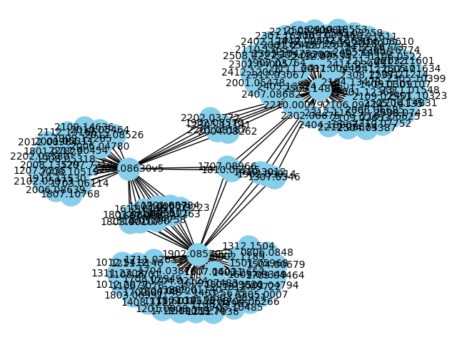

# Graph-Based Retrieval-Augmented Generation for Scientific Literature

This project implements a graph-based Retrieval-Augmented Generation (RAG) pipeline tailored for scientific literature. Instead of relying solely on vector search like usual RAG, we construct a knowledge graph based on arXiv search results using their metadata and abstracts. The retrieval is then done using graph traversal. This approach improves context relevance and retrieval precision in domain-specific settings such as scientific Q&A.

## Core idea 

When a query is passed, an arXiv search is done and a select numnber of papers are taken. 
Each of these results are then converted from pdf to text, in order to get the references mentioned (for now only extracting arXiv references). 
Each paper is then represented as a node, with node features being the paper metadata. Edges encode citations and relationship. 
This approach will make the traversal rely on meaningful connections to find better supporting evidence for the LLM queries. 
An example of the graph is show here, for a maximum number of arXiv results of 3: 



## How to run 

```bash
## First install the code
git clone git@github.com:jmsardain/graphRAG.git
cd graphRAG

## Run the code 
##### Draw the graph, doesn't evaluate
python main.py --query <query> --max <max_number_arXiv_papers> --draw
##### To run the whole code, remove --draw 
python main.py --query <query> --max <max_number_arXiv_papers> 
## query: str, e.g. graph neural networks jet tagging particle physics 
## max: int, the maximum number of results from arxiv, the initial papers from which we will take the references. 
## draw: boolean, if activated, draws the graphs and stops the code
```


## Methodology

1) Knowledge Graph Construction
    - Nodes: scientific papers (from arXiv metadata & abstracts).
    - Edges: citation links and shared-entity relationships.

2) Retrieval Approaches Compared
    - Vector-based retrieval: semantic similarity search use only metadata (texts from nodes, not the graphs themselves) 
    - Graph-based retrieval: traversing citation/entity paths to collect relevant context.

3) Final answer
    - Retrieved contexts are passed into an LLM for question answering.
    - Outputs are compared between vector-based vs graph-based retrieval.

## Results 
- Graph traversal retrieves context that is structurally relevant (papers within the same subfield, citation chains).
- Vector search sometimes pulls in semantically close but topically irrelevant results.
- Combining graph-based retrieval with LLMs improves precision and domain reliability.

## Improvements
- Not all references are extacted: instead of relying on pdf-to-text to extract arXiv, use connectedpapers API
- Hard to define a metric: it is hard to define one, since the relevance of the output from the vector-approach versus the output from the graph-traversal approach can only be done by an expert. Semantic similarity or context extraction might not be the best approach to quantify the improvement. 

## Problems/Questions ?
For questions or contributions, please contact me and open an issue 🍻